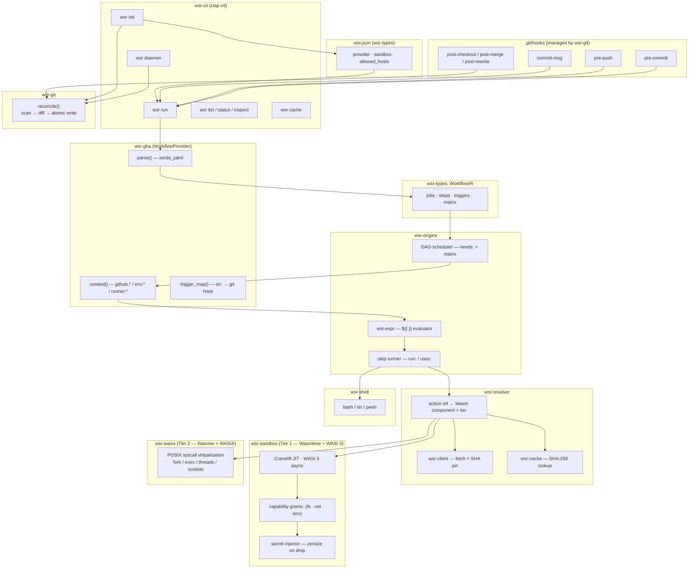
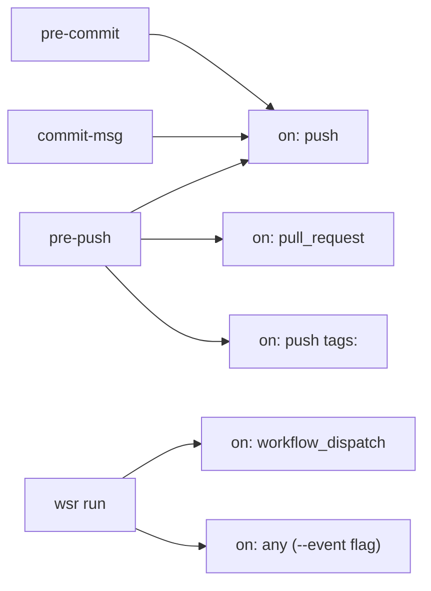
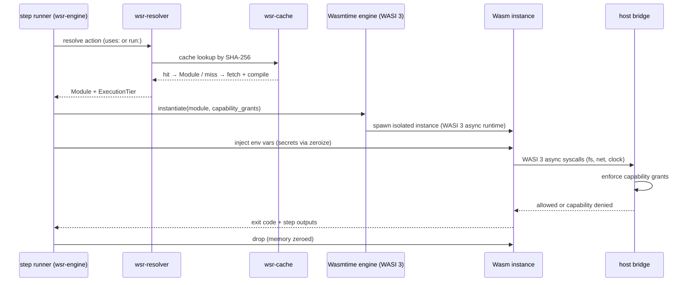
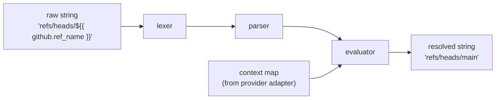

# wsr architecture

This document describes the internal architecture of `wsr`. It is intended for contributors and for
anyone who wants to understand how the pieces fit together.

For the ecosystem-level view (how `ectorial/wsr`, `ectorial/actions`, and `ectorial/wit` relate),
see the [ectorial organization architecture](https://github.com/ectorial/.github/blob/main/ARCHITECTURE.md).

---

## core principle

> **Docker virtualizes the computer. wsr virtualizes the task.**

Standard CI/CD treats every job as a machine to boot. `wsr` treats every job as a typed function
to invoke. The isolation unit is the Wasm component, not the container. The security boundary is
the WASI capability grant, not the network namespace.

This shift — from OS-level to instruction-level virtualization — is what makes millisecond cold
starts possible and Docker unnecessary.

---

## design commitments

1. **100% workflow syntax compatibility** — same YAML, same expressions, same action versions, per provider
2. **Wasm-native sandbox** — security by construction, not by policy
3. **WASI 3 async** — native async layer to Wasm, no polling or callback wrappers
4. **Stateless sync** — no lock files, no databases; trust git to own the filesystem
5. **Zero required config** — `wsr init` is enough; `wsr.json` is opt-in override

---

## crate map

```
wsr/
└── crates/
    ├── wsr-cli/          # binary — clap v4 entry point, all subcommands
    │
    ├── wsr-engine/       # job DAG scheduler, step orchestrator, matrix expansion
    ├── wsr-sandbox/      # Tier 1 — Wasmtime + WASI Preview 3, one instance per step
    ├── wsr-wasix/        # Tier 2 — Wasmer + WASIX, POSIX compat (transitional)
    ├── wsr-shell/        # run: executor — bash / sh / pwsh
    │
    ├── wsr-gha/          # GitHub Actions provider adapter (reference impl)
    ├── wsr-expr/         # ${{ }} expression evaluator (provider-agnostic)
    ├── wsr-resolver/     # action resolver — uses: → Wasm component + tier assignment
    │
    ├── wsr-git/          # git hook management, shim install, stateless reconcile
    ├── wsr-client/       # HTTP client — action fetch, SHA pinning, registry queries
    ├── wsr-cache/        # content-addressed Wasm module cache (SHA-256 keyed)
    ├── wsr-fs/           # filesystem utils — atomic writes, VFS, path helpers
    │
    ├── wsr-types/        # shared types, traits, errors — no internal dependencies
    ├── wsr-tracing/      # structured logging — human + GHA annotations formats
    └── wsr-bench/        # benchmark suite — step startup, cache, expr, vs act
```

See [`crates/README.md`](crates/README.md) for per-crate descriptions.

---

## layer diagram



---

## tiered execution model

`wsr` dispatches each job to one of two sandbox tiers. Tier selection is automatic — users never
configure it. Both engines expose a unified interface to the orchestrator; jobs communicate across
tiers transparently.

**Promotion rule:** if any step in a job requires capabilities beyond strict WASI, the entire job
is promoted to Tier 2.

### Tier 1 — The Vault (`wsr-sandbox`)

The default. Every job that can run here, does.

| Property | Value |
|---|---|
| Runtime | Wasmtime (Bytecode Alliance) |
| Cold start | ~1–3 ms |
| Security model | WASI capability-based (strict) |
| Async | WASI Preview 3 native |
| Module format | Wasm Component Model |
| Actions | `ectorial/*` native catalog |

### Tier 2 — The Workshop (`wsr-wasix`)

The compatibility layer. Activated when Tier 1 isn't sufficient yet.

| Property | Value |
|---|---|
| Runtime | Wasmer + WASIX |
| Cold start | Low ms to tens of ms (toolchain-dependent) |
| Security model | WASIX sandbox (POSIX-compatible, no host OS escape) |
| Module format | Plain Wasm modules |
| Actions | Heavy toolchains (`rustc`, LLVM, Go), complex binaries |

**WASIX is explicitly transitional.** As `ectorial/actions` coverage grows, Tier 2 workloads
migrate to Tier 1. Tier 2 is maintained as long as it keeps workflows off Docker — not a day longer.

---

## provider adapter pattern

`wsr-gha` is the reference provider. Future providers (`wsr-gitlab`, `wsr-bitbucket`) follow the
same pattern — implement `WorkflowProvider`, the engine and sandbox never know which is active.

```rust
pub trait WorkflowProvider: Send + Sync {
    /// Parse raw workflow file bytes into the normalized IR.
    fn parse(&self, raw: &[u8]) -> anyhow::Result<WorkflowIR>;

    /// Build the context object for expression evaluation.
    fn context(&self, event: &TriggerEvent) -> anyhow::Result<ContextMap>;

    /// Map provider trigger names to git hook names.
    fn trigger_map(&self) -> HashMap<Trigger, GitHook>;
}
```

`wsr-types::WorkflowIR` is the normalized representation all providers compile to. It is also the
interchange format for the daemon, the CLI, and any future tooling — serializes to JSON without
loss of information.

---

## git hook → workflow trigger mapping

Each provider implements `trigger_map()`. The GitHub adapter (`wsr-gha`) maps:



`workflow_dispatch` is the default event for `wsr run`. Add it to any workflow to enable local
manual runs without pushing — the same way you trigger it manually from the GitHub UI.

---

## sync algorithm (`wsr-git`)

Triggered by `post-checkout`, `post-merge`, `post-rewrite`, and the daemon watcher. Always a full
reconcile — never a patch.

```mermaid
flowchart TD
    A[trigger fires] --> B["scan workflow directory\nbuild desired hook map via provider.trigger_map()"]
    B --> C["read current hook map\nfrom manifest comment embedded in shims"]
    C --> D{diff}
    D -->|added|     E["write new shim — atomic: tmpfile → rename()"]
    D -->|updated|   F["overwrite shim — atomic: tmpfile → rename()"]
    D -->|removed|   G["delete shim — warn: 'workflow removed'"]
    D -->|unchanged| H[no-op]
    E & F & G & H --> I["print sync summary to stderr"]
```

**No lock file.** The manifest comment in each shim is the entire state:

```sh
#!/bin/sh
# wsr:managed provider=github workflows=ci.yml triggers=push,pull_request
exec wsr run --hook pre-push "$@"
```

---

## wasm sandbox — per-step lifecycle (`wsr-sandbox`)



**Capability grants** are computed per step from the workflow definition and `wsr.json` overrides:

```
preopened_dirs  = [workspace_dir]          # always
allowed_hosts   = []                       # default: none
env_vars        = [explicit env: keys]     # only declared vars
secrets         = [declared secret names]  # injected, never written to disk
```

---

## action resolver (`wsr-resolver`)

Resolution order for `uses: owner/action@ref`:

1. Check local content-addressed cache (SHA-256 keyed)
2. Check `ectorial/*` component registry for native Tier 1 equivalent → assign Tier 1
3. Check for WASIX-compatible build → assign Tier 2
4. No match → emit advisory warning; flag step as unresolved

The resolver **never** silently falls back to Docker.

| Action kind | Strategy |
|---|---|
| JS / TS | Fetch `action.yml` + `index.js`, compile via Javy → `.wasm`, cache by SHA |
| Composite | Inline step expansion into parent job, no Wasm overhead |
| Docker | Advisory warning; skip or error in strict mode |
| Local path | Resolve relative to workspace root |

---

## expression evaluator (`wsr-expr`)



Contexts (GitHub): `github.*` · `env.*` · `runner.*` · `secrets.*` · `needs.*` · `steps.*` · `inputs.*`

Functions: `contains` · `startsWith` · `endsWith` · `format` · `join` · `toJSON` · `fromJSON` ·
`success` · `failure` · `always` · `cancelled` · `hashFiles`

---

## observability (`wsr-tracing`)

All output goes through the `tracing` crate. Two output formats:

**human** (default) — compact, coloured, git-hook-friendly:

```
[wsr] pre-push · running ci.yml
  ✓ step: cargo test              8.1s
  ✓ step: cargo build --release  12.3s
  ✗ step: docker push             0.3s
    capability denied: net → registry.example.com
[wsr] failed · 20.4s · exit 1
```

**gha** (`--format=gha`) — GitHub Annotations, for steps consumed by a GH Actions job:

```
::error file=src/main.rs,line=42::cannot borrow `state` as mutable
::notice::step cargo test passed in 8.1s
```

---

## design decisions

| Decision | Rationale |
|---|---|
| Provider adapter pattern | GitHub Actions is the reference impl; GitLab and Bitbucket share the same engine via `WorkflowProvider` trait |
| `wsr.json` over `wsr.toml` | `serde_json` already in the tree; readable by any language; doubles as IR; `$schema` gives editor IntelliSense |
| `wsr-types` as the no-dep foundation | Prevents circular dependencies; every crate can import shared types without pulling in heavy runtimes |
| `wsr-ir` merged into `wsr-types` | The IR is part of the type contract, not a separate abstraction layer at this stage |
| Wasmtime + Cranelift (Tier 1) | Best Rust-native JIT performance; WASI 3 support most mature; Bytecode Alliance backing |
| Wasmer + WASIX (Tier 2) | Only runtime with mature POSIX virtualisation inside Wasm; no host kernel forwarding |
| One Wasm instance per step | Strongest isolation boundary; simplifies capability reasoning; cheap with AOT cache |
| Stateless sync via `rename()` | Git already serialises filesystem access during pull/checkout/rebase; no coordination needed |
| `workflow_dispatch` as default `wsr run` event | Mirrors GH Actions manual trigger; one mental model, not two |
| 100% compat before perf | Correctness is the product; optimisation is an implementation detail |
| Zero required config | `wsr init` is enough; `wsr.json` is opt-in override |
